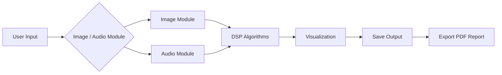

<div align="center">

# Image & Speech Processing Studio

### Digital Signal Processing Desktop Application

A modern PyQt5 studio for practical DSP experiments across image processing, speech/audio filtering, visualization, and automatic PDF report generation.


**Course:** Digital Signal Processing (DSP)  
**Institution:** October High Institute for Engineering & Technology  
**Supervisor:** Dr. Abdullah Gad

</div>

---

## Project Preview

| What This Project Shows | Why It Matters |
| --- | --- |
| Image processing in a real desktop GUI | Demonstrates DSP concepts through visual before/after results. |
| Speech/audio filtering and playback | Connects filter design to audible and visual signal changes. |
| Waveform and spectrogram visualization | Makes time-domain and frequency-domain behavior easier to understand. |
| Automatic PDF reporting | Converts experiments into academic-ready documentation. |
| Organized release workflow | Keeps source, docs, samples, reports, and executable distribution clean. |

**Quick links:** [Use Cases](docs/use-cases.md) · [Screenshots Guide](docs/screenshots.md) · [Workflow](docs/workflow.md) · [Release Notes](releases/RELEASE_NOTES.md) · [Generated Reports](docs/generated-reports)

> Screenshot note: no real GUI screenshots were included in the provided project folder. The screenshot gallery below is prepared with exact paths and capture guidance, but it intentionally avoids fake UI images.

## Screenshots Gallery

| Category | Target Screenshot | Recommended Path | Status |
| --- | --- | --- | --- |
| Main GUI | Full PyQt5 application window | `assets/screenshots/gui/main-gui.png` | Pending real capture |
| Main GUI | Splash screen | `assets/screenshots/gui/splash-screen.png` | Pending real capture |
| Image Processing Tab | Loaded image with controls | `assets/screenshots/image-processing/image-tab.png` | Pending real capture |
| Image Noise Reduction | Gaussian or median before/after | `assets/screenshots/image-processing/noise-reduction.png` | Pending real capture |
| Edge Detection | Sobel or Canny output | `assets/screenshots/image-processing/edge-detection.png` | Pending real capture |
| Audio Processing Tab | Loaded WAV workflow | `assets/screenshots/audio-processing/audio-tab.png` | Pending real capture |
| Audio Waveform Visualization | Input/output waveform plots | `assets/screenshots/audio-processing/waveform-visualization.png` | Pending real capture |
| Spectrogram Analysis | Input/output spectrogram plots | `assets/screenshots/audio-processing/spectrogram-analysis.png` | Pending real capture |
| PDF Report Export | Export dialog or report preview | `assets/screenshots/reports/pdf-export.png` | Pending real capture |
| Application Release | GitHub Release executable asset | `assets/screenshots/reports/release-download.png` | Pending after publishing |
| Project Folder Structure | Clean GitHub repository layout | `assets/screenshots/workflow/project-structure.png` | Pending real capture |

Detailed capture guidance lives in [`docs/screenshots.md`](docs/screenshots.md).

<details>
<summary>Screenshot folders</summary>

```text
assets/screenshots/
├── gui/
├── image-processing/
├── audio-processing/
├── reports/
└── workflow/
```

</details>

## Workflow Diagram



See the full workflow explanation in [`docs/workflow.md`](docs/workflow.md).

## Key Features

| Area | Implemented Capabilities |
| --- | --- |
| Image Processing | Load images, grayscale conversion, median filter, Gaussian filter, Sobel edge detection, Canny edge detection, histogram equalization, live preview, save processed image |
| Speech Processing | Load WAV, mono conversion, low-pass filter, high-pass filter, band-pass filter, speech noise-reduction preset, 50 Hz hum-reduction preset, audio playback, save filtered WAV |
| Visualization | Input/output image preview, waveform plots, spectrogram plots, processing log |
| Reporting | Automatic PDF export with settings, image results, audio waveforms, and spectrograms |
| Desktop Experience | PyQt5 GUI, modern dark purple theme, splash screen, toolbar actions, release-ready executable workflow |

Planned extensions include average filtering, bilateral filtering, Laplacian edge detection, and a dedicated band-stop/notch filter.

## Real-World Use Cases

| Domain | Example Use Cases |
| --- | --- |
| Image Processing | Remove noise from grayscale images, compare Gaussian vs median filters, detect object edges with Canny/Sobel, enhance contrast with histogram equalization, prepare images for computer vision workflows |
| Speech / Audio Processing | Reduce high-frequency noise, reduce low-frequency hum, demonstrate 50 Hz interference handling, isolate useful speech ranges with band-pass filtering, compare original and filtered audio |
| Visualization | Compare input/output waveforms, study spectrogram behavior, observe frequency components before and after filtering, teach time-domain vs frequency-domain analysis |
| Report Generation | Export automatic lab reports, document DSP experiments, save processed results for academic submission, create before/after analysis reports |
| Deployment | Run without Python using the executable, share through GitHub Releases, present the repository as a LinkedIn/CV portfolio project |

Read the full use-case matrix in [`docs/use-cases.md`](docs/use-cases.md).

## Image Processing Module

The image module uses OpenCV and NumPy to process grayscale image data through practical DSP operations:

- Load PNG, JPG, JPEG, and BMP images.
- Convert input images to grayscale.
- Apply median and Gaussian filters for denoising.
- Apply Sobel and Canny operators for edge detection.
- Apply histogram equalization for contrast enhancement.
- Tune kernel size, Gaussian sigma, and Canny thresholds.
- Save processed results as PNG or JPG.

## Speech Processing Module

The audio module uses SciPy, SoundFile, SoundDevice, NumPy, and Matplotlib:

- Load WAV files and convert stereo audio to mono.
- Normalize audio before processing and playback.
- Apply Butterworth low-pass, high-pass, and band-pass filters.
- Use zero-phase filtering with `scipy.signal.filtfilt`.
- Use presets for speech noise reduction and 50 Hz hum reduction.
- Compare input/output waveforms and spectrograms.
- Play input and processed audio from the GUI.
- Save filtered audio as WAV.

## Report Generation

The application can export a PDF report containing:

- Project identity, course, supervisor, and team metadata.
- Selected image method and parameters.
- Selected audio filter settings and order.
- Input and output image results.
- Input/output audio waveforms.
- Input/output spectrograms.

Generated examples are available in [`docs/generated-reports`](docs/generated-reports).

## Demo

No demo video was included in the provided folder. The video folder is prepared at [`videos`](videos), and the recommended public demo is:

| Demo Asset | Recommended Content |
| --- | --- |
| `videos/app-demo.mp4` | 60-120 second walkthrough covering image processing, audio filtering, visualization, and PDF export. |
| `videos/report-export-demo.mp4` | Short focused clip showing automatic PDF report generation. |

Large videos can be uploaded to GitHub Releases, Google Drive, or YouTube, then linked here.

## Release Download

The standalone Windows executable is approximately 171 MB, so it should be distributed through GitHub Releases or Google Drive instead of being committed directly.

| Release Item | Location / Guidance |
| --- | --- |
| Release notes | [`releases/RELEASE_NOTES.md`](releases/RELEASE_NOTES.md) |
| Local executable copy | `_local_artifacts/executable/DSP_Image_Speech_Studio.exe` |
| Public distribution | Upload executable to GitHub Releases under tag `v1.0` |
| QR code asset | [`assets/qr/application-download-qr.png`](assets/qr/application-download-qr.png) |

## Installation

```bash
git clone https://github.com/YourUsername/DSP-Image-Speech-Processing-Studio.git
cd DSP-Image-Speech-Processing-Studio
```

Create and activate a virtual environment on Windows PowerShell:

```powershell
python -m venv .venv
.\.venv\Scripts\Activate.ps1
```

Install dependencies:

```powershell
pip install --upgrade pip
pip install -r requirements.txt
```

## Run From Source

```powershell
python src/main.py
```

The application expects image files in common image formats and audio files in WAV format.

## Requirements

| Library | Purpose |
| --- | --- |
| PyQt5 | Desktop GUI |
| OpenCV | Image processing |
| NumPy | Numerical operations |
| SciPy | DSP filtering and spectrograms |
| Matplotlib | Waveform and spectrogram plots |
| SoundFile | WAV loading and saving |
| SoundDevice | Audio playback |
| ReportLab | PDF report generation |

Windows 64-bit and Python 3.10 or newer are recommended.

## Project Structure

```text
DSP-Image-Speech-Processing-Studio/
├── assets/
│   ├── icons/
│   ├── qr/
│   └── screenshots/
│       ├── gui/
│       ├── image-processing/
│       ├── audio-processing/
│       ├── reports/
│       └── workflow/
├── docs/
│   ├── generated-reports/
│   ├── legacy/
│   ├── presentation/
│   ├── report/
│   ├── use-cases/
│   ├── screenshots.md
│   ├── use-cases.md
│   └── workflow.md
├── releases/
├── samples/
├── src/
│   └── main.py
├── videos/
├── CONTRIBUTING.md
├── LICENSE
├── README.md
└── requirements.txt
```

Large local-only files such as the executable and PyInstaller build output are preserved under `_local_artifacts/` and ignored by Git.

## Academic Deliverables

| Deliverable | Link |
| --- | --- |
| Final report PDF | [`docs/report/digital-signal-processing-report.pdf`](docs/report/digital-signal-processing-report.pdf) |
| Editable report DOCX | [`docs/report/digital-signal-processing-report.docx`](docs/report/digital-signal-processing-report.docx) |
| Presentation PDF | [`docs/presentation/image-speech-processing-studio.pdf`](docs/presentation/image-speech-processing-studio.pdf) |
| Presentation PPTX | [`docs/presentation/image-speech-processing-studio.pptx`](docs/presentation/image-speech-processing-studio.pptx) |
| Generated report examples | [`docs/generated-reports`](docs/generated-reports) |

## Educational Value

This project is useful for DSP teaching because it connects theory to interaction:

- Students can tune filter parameters and observe the result immediately.
- Image and audio workflows show that DSP concepts apply across signal types.
- Waveforms and spectrograms make abstract frequency behavior visible.
- PDF export turns experiments into submission-ready reports.
- The repository structure demonstrates how academic code can become a public portfolio project.

## Team Members

| Name |
| --- |
| Ziad Mohamed Fathy |
| Moaz Atef Gouda |
| Ibrahim Mohamed Saad |
| Mohamed Ali Rushdi |
| Mohamed Abdel-Fadil |

## Supervisor and Institution

| Field | Details |
| --- | --- |
| Course | Digital Signal Processing (DSP) |
| Supervisor | Dr. Abdullah Gad |
| Institution | October High Institute for Engineering & Technology |
| Department | Telecommunications & Electronics Engineering |

## Future Improvements

- Add average, bilateral, and Laplacian image filters.
- Add a true band-stop/notch audio filter.
- Add official screenshots and a short demo video.
- Add automated tests for DSP helper functions and report export.
- Split the GUI into smaller maintainable modules.
- Add a PyInstaller build workflow and release checklist.

## License

This project is released under the MIT License. See [`LICENSE`](LICENSE).

## Academic Note

This repository was prepared as a Digital Signal Processing course project. It is intended for learning, demonstration, and portfolio use. If reused academically, cite the original team and institution appropriately.
