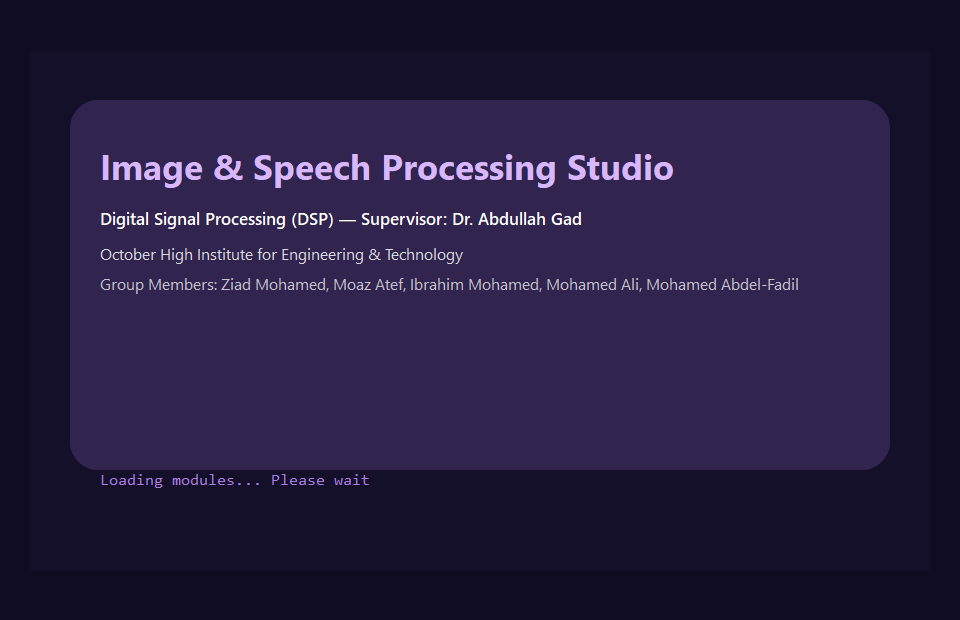
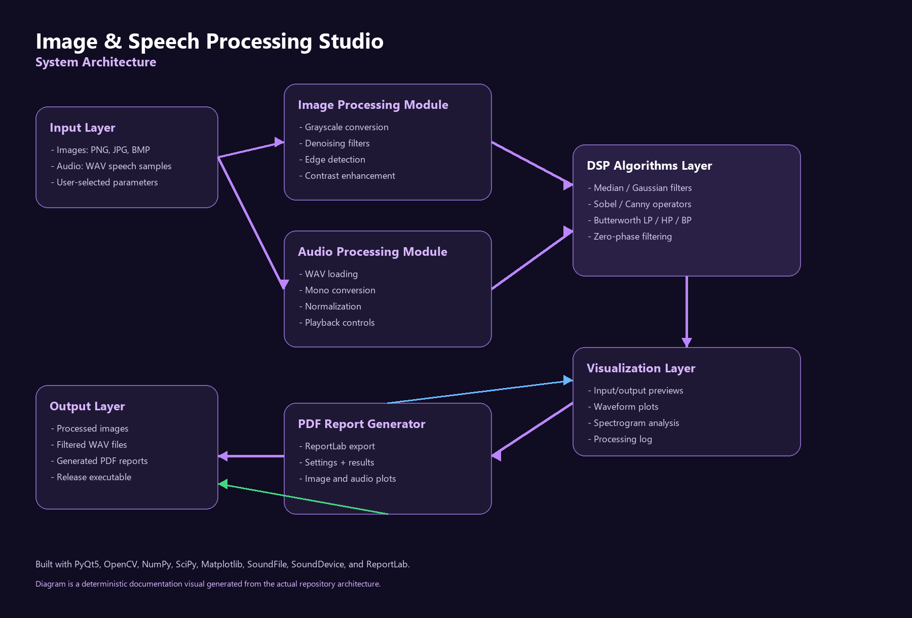
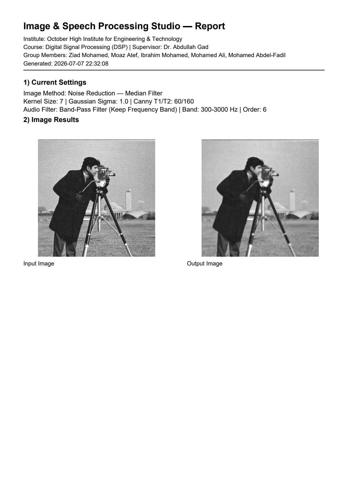
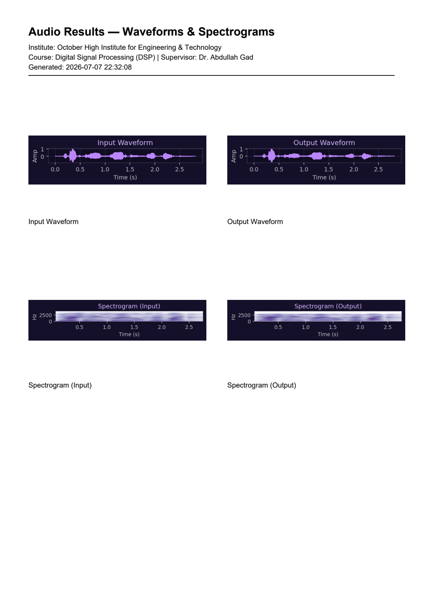

<div align="center">

# Image & Speech Processing Studio

### Digital Signal Processing Desktop Application

A modern PyQt5 desktop studio for image processing, speech/audio filtering, waveform and spectrogram visualization, and automatic PDF report generation.


**Course:** Digital Signal Processing (DSP)  
**Institution:** October High Institute for Engineering & Technology  
**Supervisor:** Dr. Abdullah Gad

</div>

---

## Application Preview

Real screenshots captured from the running PyQt5 application using the sample image/audio data in this repository.

| Main GUI | Image Processing | Audio Processing |
| --- | --- | --- |
|  |  |  |



More captures and the capture checklist are available in [`docs/screenshots.md`](docs/screenshots.md).

## Real-World Use Cases

| Use Case | Input | DSP Technique | Practical Output |
| --- | --- | --- | --- |
| Image denoising | Noisy image | Gaussian or median filtering | Cleaner image for inspection or preprocessing |
| Edge detection | Grayscale image | Sobel or Canny operator | Object boundaries and edge maps |
| Contrast enhancement | Low-contrast image | Histogram equalization | Improved visual detail |
| Speech noise removal | WAV speech | Low-pass filtering | Reduced high-frequency noise |
| Electrical hum removal | WAV speech | High-pass filtering preset | Reduced low-frequency hum |
| Band-pass speech isolation | WAV speech | Butterworth band-pass filter | Focused speech frequency range |
| Waveform and spectrogram analysis | WAV audio | Time/frequency visualization | Before/after signal comparison |
| PDF report generation | Processed session | ReportLab export | Academic-ready experiment report |
| Academic lab demonstration | Image and audio samples | Interactive DSP controls | Practical teaching workflow |
| Portfolio/demo deployment | Source and executable | GitHub release workflow | Public project showcase |

Detailed scenarios are documented in [`docs/use-cases.md`](docs/use-cases.md).

## System Architecture



Architecture notes and a Mermaid reference diagram are available in [`docs/architecture.md`](docs/architecture.md).

## Application Workflow


The full workflow explanation is in [`docs/workflow.md`](docs/workflow.md).

## Key Features

| Area | Implemented Capabilities |
| --- | --- |
| Image Processing | Load images, grayscale conversion, median filter, Gaussian filter, Sobel edge detection, Canny edge detection, histogram equalization, live preview, save processed image |
| Speech Processing | Load WAV, mono conversion, low-pass filter, high-pass filter, band-pass filter, speech noise-reduction preset, 50 Hz hum-reduction preset, audio playback, save filtered WAV |
| Visualization | Input/output image preview, waveform plots, spectrogram plots, processing log |
| Reporting | Automatic PDF export with settings, image results, audio waveforms, and spectrograms |
| Desktop Experience | PyQt5 GUI, dark purple theme, splash screen, toolbar actions, release-ready executable workflow |

## Report Generation

The application exports PDF reports containing project metadata, selected DSP settings, image results, audio waveforms, and spectrogram plots.

| Generated Report Page | Audio Report Page |
| --- | --- |
|  |  |

Generated PDF examples are available in [`docs/generated-reports`](docs/generated-reports).

## Demo GIF

The current demo GIF is stored at [`assets/demo/app-demo.gif`](assets/demo/app-demo.gif). It was assembled from real captured application states.

For recording a smoother 10 to 15 second manual walkthrough, see [`docs/demo-gif.md`](docs/demo-gif.md).

## Release Download

The standalone Windows executable is approximately 171 MB, so it should be distributed through GitHub Releases or Google Drive instead of being committed directly.

| Release Item | Location / Guidance |
| --- | --- |
| Release notes | [`releases/RELEASE_NOTES.md`](releases/RELEASE_NOTES.md) |
| Local executable copy | `_local_artifacts/executable/DSP_Image_Speech_Studio.exe` |
| Public distribution | Upload executable to GitHub Releases under tag `v1.0` |
| QR code asset | [`assets/qr/application-download-qr.png`](assets/qr/application-download-qr.png) |

The release-page screenshot is intentionally not embedded yet because a public GitHub Release page has not been created.

## Installation

```bash
git clone https://github.com/YourUsername/DSP-Image-Speech-Processing-Studio.git
cd DSP-Image-Speech-Processing-Studio
```

Create and activate a virtual environment on Windows PowerShell:

```powershell
python -m venv .venv
.\.venv\Scripts\Activate.ps1
```

Install dependencies:

```powershell
pip install --upgrade pip
pip install -r requirements.txt
```

## Run From Source

```powershell
python src/main.py
```

The application expects common image formats such as PNG, JPG, JPEG, and BMP, and audio input in WAV format.

## Requirements

| Library | Purpose |
| --- | --- |
| PyQt5 | Desktop GUI |
| OpenCV | Image processing |
| NumPy | Numerical operations |
| SciPy | DSP filtering and spectrograms |
| Matplotlib | Waveform and spectrogram plots |
| SoundFile | WAV loading and saving |
| SoundDevice | Audio playback |
| ReportLab | PDF report generation |

Windows 64-bit and Python 3.10 or newer are recommended.

## Project Structure

```text
DSP-Image-Speech-Processing-Studio/
├── assets/
│   ├── demo/
│   ├── diagrams/
│   ├── icons/
│   ├── qr/
│   └── screenshots/
├── docs/
│   ├── generated-reports/
│   ├── presentation/
│   ├── report/
│   ├── architecture.md
│   ├── branding.md
│   ├── demo-gif.md
│   ├── screenshots.md
│   ├── use-cases.md
│   └── workflow.md
├── releases/
├── samples/
├── src/
│   └── main.py
├── videos/
├── CONTRIBUTING.md
├── LICENSE
├── README.md
└── requirements.txt
```

Large local-only files such as the executable and PyInstaller build output are preserved under `_local_artifacts/` and ignored by Git.

## Academic Deliverables

| Deliverable | Link |
| --- | --- |
| Final report PDF | [`docs/report/digital-signal-processing-report.pdf`](docs/report/digital-signal-processing-report.pdf) |
| Editable report DOCX | [`docs/report/digital-signal-processing-report.docx`](docs/report/digital-signal-processing-report.docx) |
| Presentation PDF | [`docs/presentation/image-speech-processing-studio.pdf`](docs/presentation/image-speech-processing-studio.pdf) |
| Presentation PPTX | [`docs/presentation/image-speech-processing-studio.pptx`](docs/presentation/image-speech-processing-studio.pptx) |
| Generated report examples | [`docs/generated-reports`](docs/generated-reports) |

## Educational Value

- Students can tune filter parameters and observe results immediately.
- Image and audio workflows show that DSP concepts apply across signal types.
- Waveforms and spectrograms make frequency behavior visible.
- PDF export turns experiments into submission-ready reports.
- The repository structure demonstrates how academic code can become a public portfolio project.

## Team Members

| Name |
| --- |
| Ziad Mohamed Fathy |
| Moaz Atef Gouda |
| Ibrahim Mohamed Saad |
| Mohamed Ali Rushdi |
| Mohamed Abdel-Fadil |

## Supervisor and Institution

| Field | Details |
| --- | --- |
| Course | Digital Signal Processing (DSP) |
| Supervisor | Dr. Abdullah Gad |
| Institution | October High Institute for Engineering & Technology |
| Department | Telecommunications & Electronics Engineering |

## Future Improvements

- Real-time webcam image processing.
- Live microphone audio processing.
- FFT spectrum visualization.
- More advanced DSP filters.
- Batch processing.
- Cross-platform packaging.
- Performance optimization.
- Optional machine-learning-based denoising.

## Additional Documentation

| Document | Purpose |
| --- | --- |
| [`docs/screenshots.md`](docs/screenshots.md) | Screenshot checklist and capture guidance |
| [`docs/use-cases.md`](docs/use-cases.md) | Detailed real-world use-case matrix |
| [`docs/workflow.md`](docs/workflow.md) | End-to-end DSP workflow explanation |
| [`docs/architecture.md`](docs/architecture.md) | System architecture and module responsibilities |
| [`docs/demo-gif.md`](docs/demo-gif.md) | Demo GIF recording and embedding guide |
| [`docs/branding.md`](docs/branding.md) | Visual branding and README consistency guide |

## License

This project is released under the MIT License. See [`LICENSE`](LICENSE).

## Academic Note

This repository was prepared as a Digital Signal Processing course project. It is intended for learning, demonstration, and portfolio use. If reused academically, cite the original team and institution appropriately.
