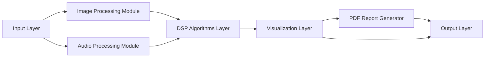

# System Architecture

The application is organized as a desktop DSP studio with separate image, audio, visualization, reporting, and output responsibilities.

## Architecture Layers

| Layer | Responsibility |
| --- | --- |
| Input Layer | Accept image files, WAV audio files, and user-selected filter parameters. |
| Image Processing Module | Convert images to grayscale and apply denoising, edge detection, and contrast enhancement workflows. |
| Audio Processing Module | Load WAV files, convert stereo to mono, normalize samples, and manage playback controls. |
| DSP Algorithms Layer | Apply image filters and Butterworth low-pass, high-pass, and band-pass audio filters. |
| Visualization Layer | Present input/output image previews, waveforms, spectrograms, and processing logs. |
| PDF Report Generator | Export settings, image results, waveform plots, and spectrogram plots into a report. |
| Output Layer | Save processed images, filtered WAV files, generated reports, and release artifacts. |

## Mermaid Reference

The PNG diagram is stored in `assets/diagrams/architecture-diagram.png`.
