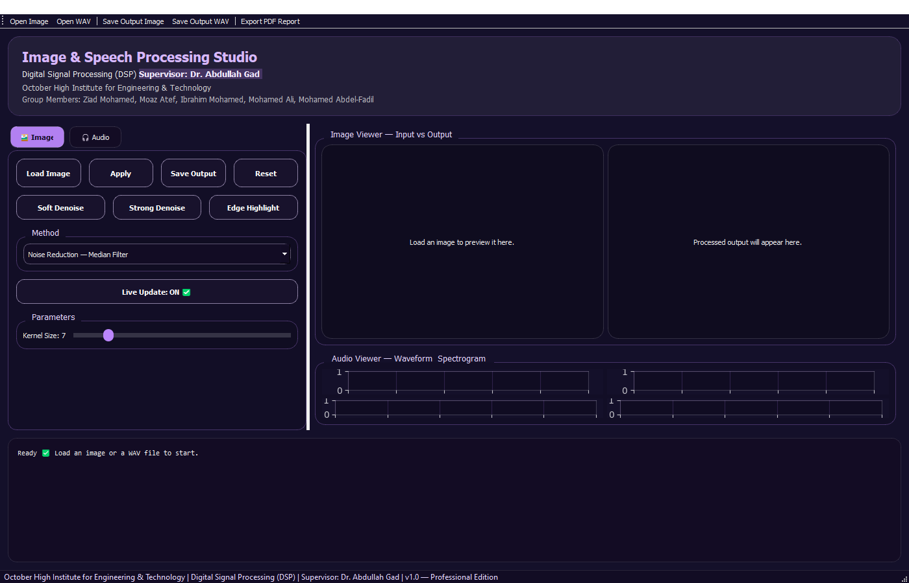
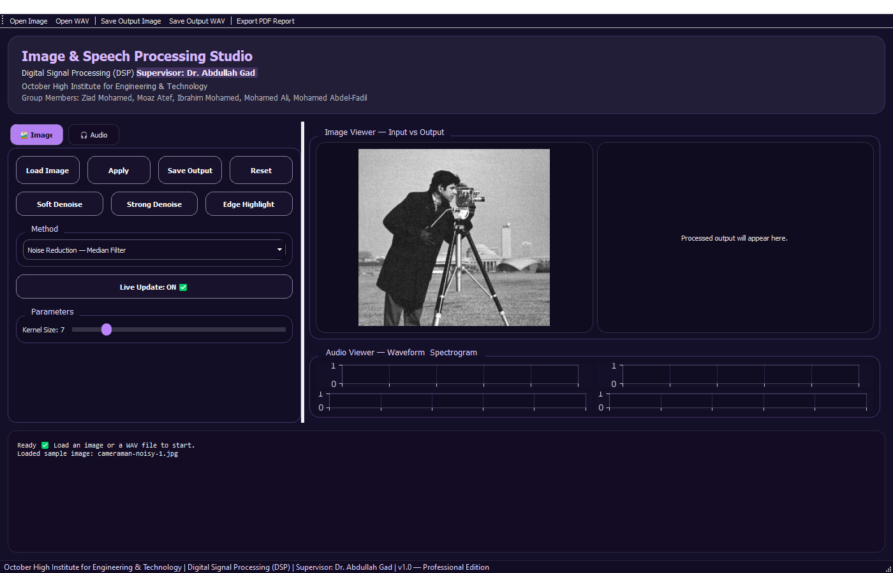
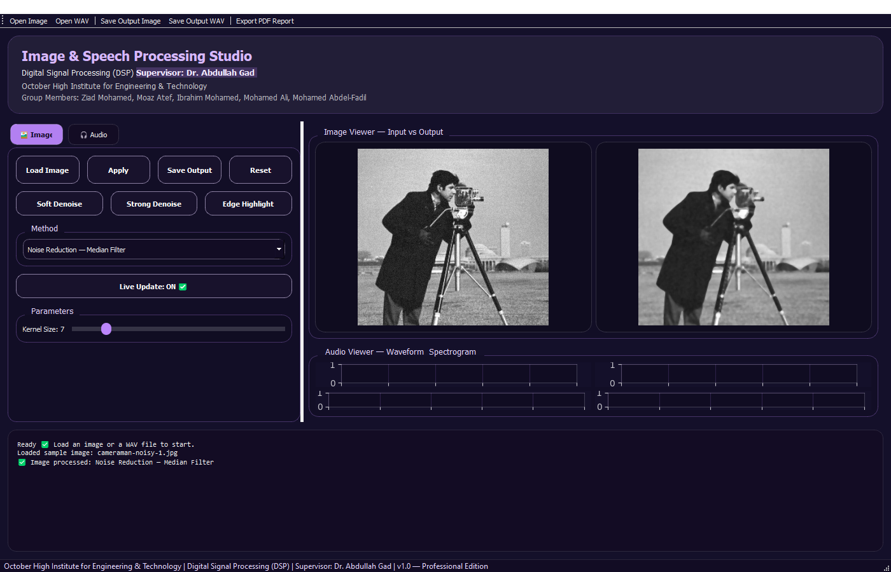
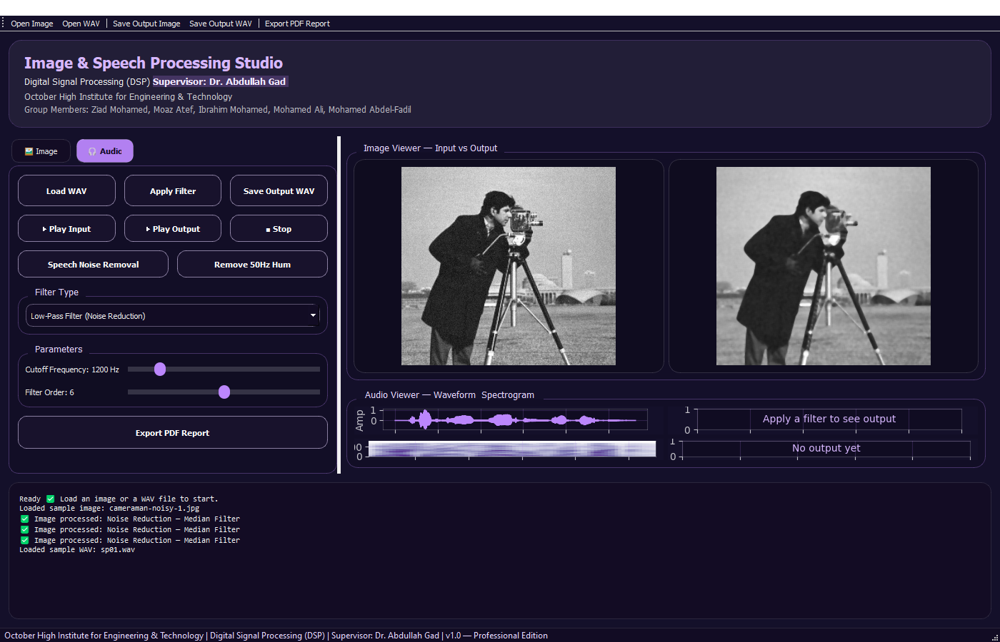
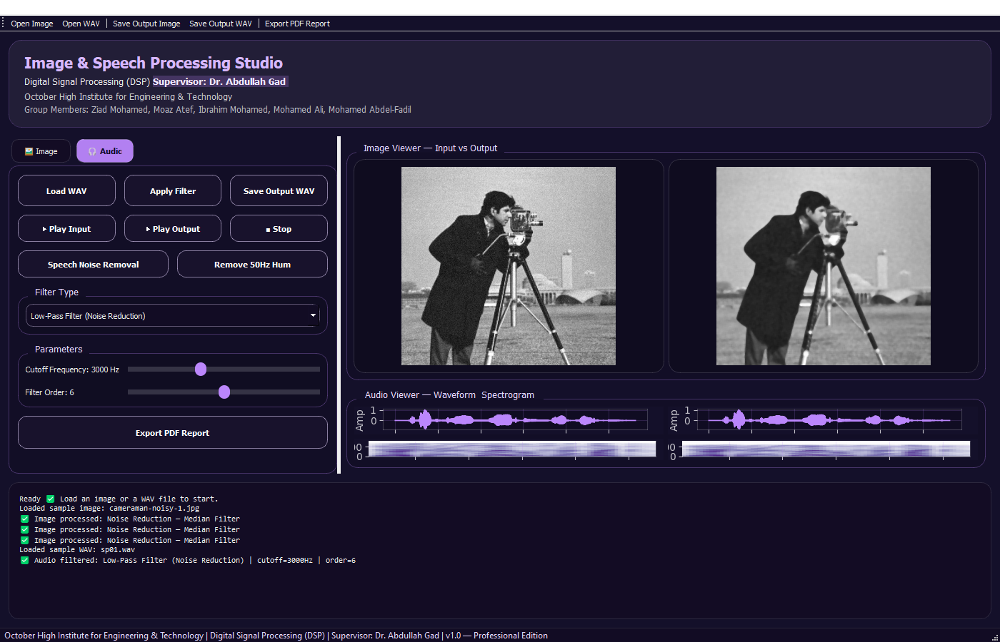
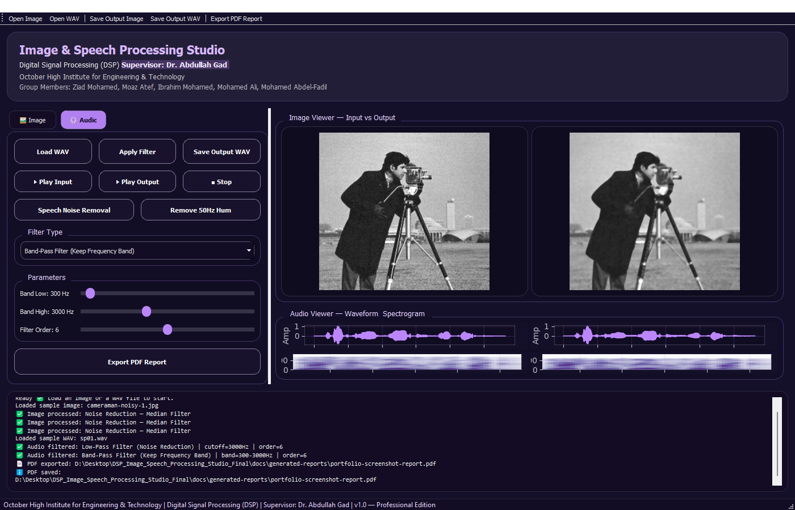
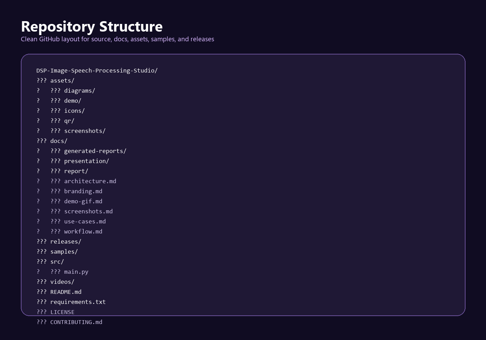

# Screenshots Guide

This guide defines the screenshot set needed for a polished GitHub, LinkedIn, CV, and academic portfolio presentation.

Most core screenshots have now been captured from the real PyQt5 application using sample image/audio data from this repository. The GitHub release screenshot remains pending until the repository is published and a release asset exists.

## Screenshot Checklist

| Screenshot Name | Recommended File Path | What It Should Show | README Usage | Status |
| --- | --- | --- | --- | --- |
| Main GUI | `assets/screenshots/gui/main-gui.png` | Full application window with the dark purple PyQt5 interface, tabs, controls, and preview panels. | Application Preview | Captured |
| Splash Screen | `assets/screenshots/gui/splash-screen.png` | Startup splash screen with project identity. | Screenshots Gallery | Captured |
| Image Processing Tab | `assets/screenshots/image-processing/image-tab.png` | Image tab with loaded input image and controls. | Application Preview | Captured |
| Image Noise Reduction | `assets/screenshots/image-processing/noise-reduction.png` | Before/after result using Gaussian or median filtering. | Image Processing Module | Captured |
| Edge Detection | `assets/screenshots/image-processing/edge-detection.png` | Sobel or Canny output with clear edges. | DSP Techniques | Captured |
| Histogram Equalization | `assets/screenshots/image-processing/histogram-equalization.png` | Contrast-enhancement before/after result. | Screenshots Gallery | Captured |
| Audio Processing Tab | `assets/screenshots/audio-processing/audio-tab.png` | Loaded WAV file with audio controls visible. | Application Preview | Captured |
| Waveform Visualization | `assets/screenshots/audio-processing/waveform-visualization.png` | Input and output waveform plots. | Speech Processing Module | Captured |
| Spectrogram Analysis | `assets/screenshots/audio-processing/spectrogram-analysis.png` | Input and output spectrograms before/after filtering. | Visualization Use Cases | Captured |
| Filter Controls | `assets/screenshots/audio-processing/filter-controls.png` | Cutoff frequency, band range, order, and playback controls. | Screenshots Gallery | Captured |
| PDF Export | `assets/screenshots/reports/pdf-export.png` | Application after PDF export using the real report export workflow. | Report Generation | Captured |
| Generated Report Page | `assets/screenshots/reports/generated-report-page-1.png` | First page of generated PDF report. | Report Generation | Captured |
| Audio Report Page | `assets/screenshots/reports/generated-report-audio.png` | Report page with waveform/spectrogram plots. | Report Generation | Captured |
| Release Download | `assets/screenshots/reports/release-download.png` | GitHub Release or download page with executable asset. | Release Download | Pending after publish |
| Project Folder Structure | `assets/screenshots/workflow/project-structure.png` | Clean repository folder layout. | Project Structure | Captured |
| Workflow Overview | `assets/screenshots/workflow/workflow-overview.png` | End-to-end process from input to report export. | Application Workflow | Captured |

## README Markdown Snippets

Use these snippets for screenshots that already exist:

```markdown









```

For the root `README.md`, remove the leading `../` from each path:

```markdown

```

## Capture Quality Guidelines

- Capture on Windows with 125 percent scaling or lower for crisp UI text.
- Use the same sample image/audio files across screenshots for consistency.
- Crop only if it improves clarity; keep enough UI context to prove the screenshot is from the actual app.
- Avoid personal usernames, private folders, browser tabs, or unrelated desktop icons.
- Export images as PNG for UI screenshots.
- Keep filenames lowercase and kebab-case.
