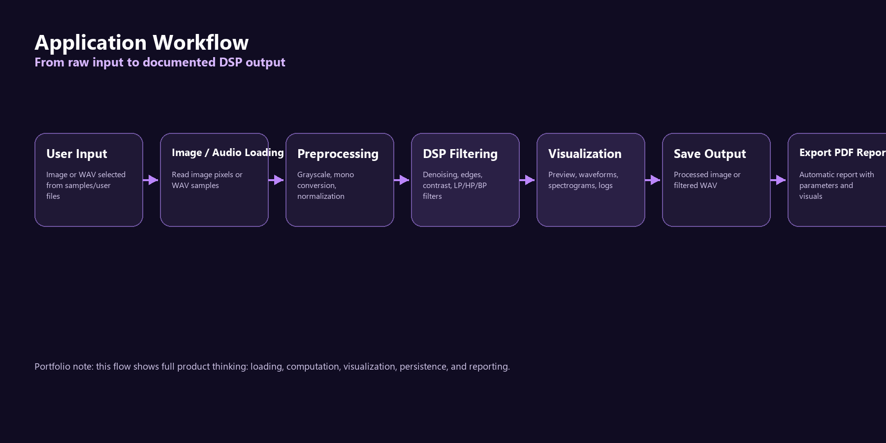
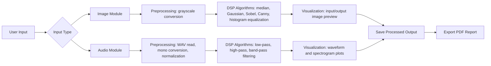

# Project Workflow

The application follows a clear DSP workflow: load an input, preprocess it, apply DSP operations, visualize the result, save outputs, and export a report.

## End-to-End Flow

## Workflow Stages

| Stage | Image Workflow | Audio Workflow | Output |
| --- | --- | --- | --- |
| Input | Load PNG, JPG, JPEG, or BMP image | Load WAV audio file | Raw user-selected signal |
| Preprocessing | Convert to grayscale | Convert stereo to mono and normalize | Standardized signal for processing |
| DSP Processing | Apply denoising, edge detection, or contrast enhancement | Apply low-pass, high-pass, or band-pass filter | Processed image or audio |
| Visualization | Show input and output image previews | Plot waveform and spectrogram views | Before/after visual comparison |
| Save Output | Save processed PNG/JPG | Save filtered WAV | Reusable result file |
| Export | Generate PDF report | Embed audio visualizations in PDF | Academic-ready report |

## Portfolio Narrative

This workflow is valuable because it shows the complete engineering path from raw data to documented output. The project is not only a filter demo; it includes user interaction, DSP computation, visualization, file export, and release planning.
